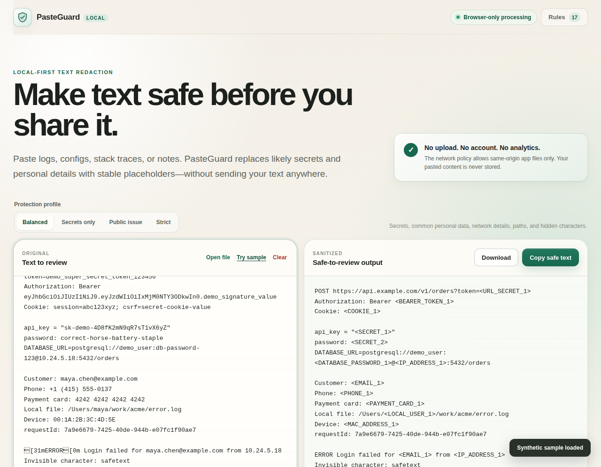

<div align="center">
  
  <h1>PasteGuard</h1>
  <p><strong>Make text safe before you share it.</strong></p>
  <p>
    A local-first browser tool that replaces likely secrets, personal data, local paths,
    network details, and invisible characters with stable placeholders.
  </p>
  <p>
    <a href="https://zjjxwpstcnsm-gif.github.io/pasteguard/"><strong>Open web app</strong></a> ·
    <a href="sharesafe-local.html?raw=1"><strong>Download offline HTML</strong></a> ·
    <a href="SECURITY.md">Security model</a> ·
    <a href="CONTRIBUTING.md">Contributing</a>
  </p>
  <p>
    
    
    
  </p>
</div>



## Quick start

### Option 1: open the web app

Open **[PasteGuard on GitHub Pages](https://zjjxwpstcnsm-gif.github.io/pasteguard/)**, paste text into the left panel, review the findings, then copy or download the sanitized result.

### Option 2: use the standalone offline page

No Node.js, npm, installation, or local server is required.

1. Download [`sharesafe-local.html`](sharesafe-local.html?raw=1) or the canonical [`portable/pasteguard-local.html`](portable/pasteguard-local.html?raw=1).
2. Double-click the downloaded file.
3. Open it with Chrome, Edge, Firefox, or another current browser.
4. Paste logs, configs, stack traces, URLs, or notes.
5. Review the detected values and copy the safe version.

Both files contain the complete interface, styles, and sanitization engine. They work through `file://` and do not start a background service. `sharesafe-local.html` is retained at the repository root exactly as requested for compatibility; `portable/pasteguard-local.html` is the canonical PasteGuard filename. Their contents are identical.

> `npm run dev` is only for contributors changing the source code. Everyday users should use the hosted app or the standalone HTML file.

## What PasteGuard does

People routinely paste production logs, configuration snippets, error messages, and support notes into GitHub issues, chat rooms, forums, and AI tools. Those snippets can accidentally include credentials, personal information, internal infrastructure, or invisible Unicode.

PasteGuard creates a reviewable copy entirely inside the browser:

```text
Authorization: Bearer eyJhbGciOi...
user=maya@example.com
path=/Users/maya/work/error.log
```

becomes:

```text
Authorization: Bearer <BEARER_TOKEN_1>
user=<EMAIL_1>
path=/Users/<LOCAL_USER_1>/work/error.log
```

Repeated values receive repeated placeholders, so useful relationships remain visible without exposing the original value.

## Why local-first

- **No upload:** pasted content is processed in browser memory.
- **No account:** there is no login, cloud database, analytics SDK, or advertising script.
- **No model call:** detection is deterministic and does not send text to an AI API.
- **No hidden persistence:** input is not written to local storage, IndexedDB, cookies, or a backend.
- **Reviewable output:** every replacement includes a rule, severity, confidence, and source location.
- **Stable placeholders:** equal values map to equal placeholders within one sanitization run.

PasteGuard is a defense-in-depth helper, not a formal data-loss-prevention product. Always review the final output before publishing confidential material.

## Detection rules

The first release contains 19 deterministic rules grouped into six categories.

| Category | Examples |
|---|---|
| Secrets | Private keys, Bearer tokens, cookies, JWTs, known token prefixes, assigned secrets |
| URLs and connections | Sensitive query parameters and passwords inside database URLs |
| Personal data | Email addresses, phone-shaped values, Luhn-valid payment card numbers |
| Network details | IPv4 and MAC addresses |
| Device details | Usernames exposed by macOS, Linux, and Windows home paths |
| Identifiers and hygiene | UUIDs, assigned IDs, ANSI escapes, zero-width and bidi control characters |

Four presets are included:

- **Balanced:** the default profile for everyday logs and snippets.
- **Secrets only:** a lower false-positive surface for credentials and tokens.
- **Public issue:** stricter handling for public support threads and GitHub issues.
- **Strict:** every built-in detector, including generic identifiers and UUIDs.

See [docs/RULES.md](docs/RULES.md) for rule behavior and contribution guidance.

## Repository layout

```text
pasteguard/
├── sharesafe-local.html        Compatibility single-file offline app
├── portable/
│   └── pasteguard-local.html   Double-clickable, single-file offline app
├── docs/
│   ├── preview.png             Product screenshot
│   ├── RULES.md
│   └── ROADMAP.md
├── src/
│   ├── app.ts                  Browser UI and interactions
│   ├── styles.css              Dependency-free visual system
│   └── engine/                 Deterministic sanitization engine
├── tests/                      Node built-in test runner
├── scripts/                    Build, preview, and test scripts
├── public/                     PWA manifest, icon, and service worker
└── .github/workflows/          CI and GitHub Pages deployment
```

The sanitization engine has no DOM dependency, allowing later reuse in a CLI, browser extension, VS Code extension, or npm package.

## Development

Node.js 20 or newer is required only for contributors:

```bash
git clone https://github.com/zjjxwpstcnsm-gif/pasteguard.git
cd pasteguard
npm install
npm run dev
```

Open `http://127.0.0.1:4173`. This is a development-only static file server; it is not an application backend and never receives pasted text.

Run the complete verification suite:

```bash
npm run check
```

Outputs:

- `dist/`: static website for GitHub Pages or another static host;
- `portable/pasteguard-local.html`: canonical standalone offline application;
- `sharesafe-local.html`: identical compatibility copy retained at the repository root.

| Command | Purpose |
|---|---|
| `npm run dev` | Build, watch source files, and serve the static app locally |
| `npm run typecheck` | Run strict TypeScript validation |
| `npm test` | Build and run the Node test suite |
| `npm run build` | Produce the hosted static `dist/` directory |
| `npm run build:portable` | Produce `portable/pasteguard-local.html` |
| `npm run preview` | Serve an existing production build |
| `npm run check` | Typecheck, test, and build both release formats |

## Browser support

PasteGuard targets current evergreen desktop and mobile browsers. The hosted version uses ES modules and a service worker. The standalone version bundles all application code and CSS into one HTML file and does not register a service worker.

## Roadmap

The MVP deliberately excludes accounts, cloud sync, AI inference, document parsing, and team policy management. Near-term work is tracked in [docs/ROADMAP.md](docs/ROADMAP.md).

## Contributing

High-value contributions include narrow false-positive or false-negative fixtures, deterministic detectors, accessibility improvements, browser compatibility fixes, and translations that preserve security terminology. Never submit real credentials or production data in an issue.

Read [CONTRIBUTING.md](CONTRIBUTING.md) before opening a pull request.

## 中文说明

PasteGuard 是一个完全在浏览器本地运行的文本脱敏工具。普通用户不需要安装 Node.js，也不需要启动 npm 服务：可以直接打开 GitHub Pages，或者下载仓库根目录的 `sharesafe-local.html`（兼容文件名）或 `portable/pasteguard-local.html` 后双击使用。

把日志、配置、报错信息或准备发给 AI 的文本粘贴进去，它会识别常见密钥、Token、邮箱、手机号、银行卡号、IP、本地用户名以及不可见字符，并生成使用稳定占位符替换后的版本。原始文本不会上传到服务器。

## License

[MIT](LICENSE)
